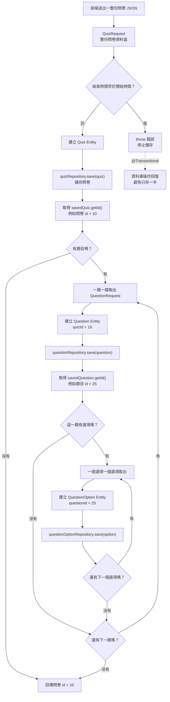

# 建立問卷流程


```mermaid
flowchart TD
    A["前端送出一整份問卷 JSON"] --> B["QuizRequest<br/>整份問卷資料盒"]

    B --> C{"結束時間早於開始時間？"}

    C -- "是" --> D["throw 錯誤<br/>停止儲存"]
    C -- "否" --> E["建立 Quiz Entity"]

    E --> F["quizRepository.save(quiz)<br/>儲存問卷"]
    F --> G["取得 savedQuiz.getId()<br/>例如問卷 id = 10"]

    G --> H{"有題目嗎？"}

    H -- "沒有" --> I["回傳問卷 id = 10"]
    H -- "有" --> J["一題一題取出 QuestionRequest"]

    J --> K["建立 Question Entity<br/>quizId = 10"]
    K --> L["questionRepository.save(question)"]
    L --> M["取得 savedQuestion.getId()<br/>例如題目 id = 25"]

    M --> N{"這一題有選項嗎？"}

    N -- "沒有" --> O{"還有下一題嗎？"}
    N -- "有" --> P["一個選項一個選項取出"]

    P --> Q["建立 QuestionOption Entity<br/>questionId = 25"]
    Q --> R["questionOptionRepository.save(option)"]
    R --> S{"還有下一個選項嗎？"}

    S -- "有" --> P
    S -- "沒有" --> O

    O -- "有" --> J
    O -- "沒有" --> I

    D -. "@Transactional" .-> T["資料庫操作回復<br/>避免只存一半"]
```

## 資料盒關係

```text
QuizRequest
└── QuestionRequest
    └── OptionRequest
```

## 資料表關係

```text
quiz
└── question
    └── question_option
```

## 一句話

先存問卷，拿到問卷 id 後存題目，再拿到題目 id 後存選項。
